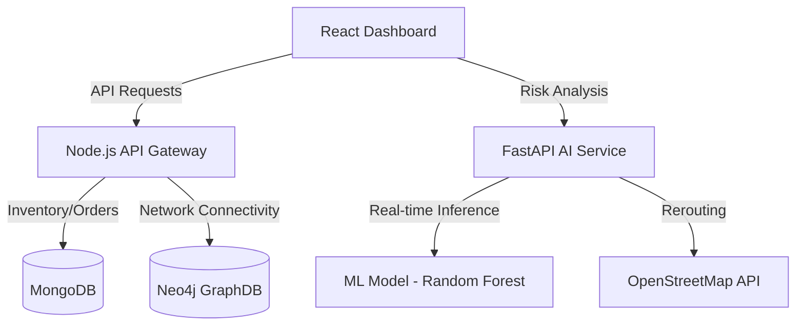

# 🚀 SupplySense AI — Smart Supply Chain Platform
### Google Solution Challenge 2026 Submission

[](https://developers.google.com/community/gdsc-solution-challenge)
[]()
[]()
[](LICENSE)

**SupplySense AI** is an intelligent supply chain resilience platform that detects and prevents logistics disruptions before they cascade. By combining **Machine Learning risk prediction** with **Neo4j GraphDB network analysis**, we empower logistics providers to safeguard the global supply chain in real-time.

---

## 📺 Project Demo
*   **Demo Video**: [https://drive.google.com/file/d/1mR3aH2te_EI6qiIohSVsQVIfxtqu4Kyj/view?usp=drivesdk]
*   **Live Dashboard**: [https://drive.google.com/file/d/1mR3aH2te_EI6qiIohSVsQVIfxtqu4Kyj/view?usp=drivesdk]

---

## 📌 Project Overview

### 🔴 The Problem
Traditional supply chain systems are reactive. When a disruption occurs (weather, port congestion, accidents), managers often learn about it after the impact has already cascaded. In India alone, logistics disruptions cause losses exceeding **₹2 lakh crore annually**.

### 💡 The Solution
**SupplySense AI** provides a "Network Brain" for logistics:
1.  **AI Risk Prediction**: A Random Forest model predicts delay risks (0-100%) based on real-time weather and traffic telemetry.
2.  **Cascade Analysis**: Using a Neo4j Graph Database, we instantly calculate which downstream warehouses and orders are at risk when a specific node fails.
3.  **Proactive Rerouting**: Dynamic optimization provides alternative paths *before* a truck enters a bottleneck.

---

## 🎯 UN Sustainable Development Goals (SDGs)

| Goal | Contribution |
| :--- | :--- |
| **SDG 9: Industry & Innovation** | Modernizing logistics infrastructure with AI-driven resilience. |
| **SDG 11: Sustainable Cities** | Reducing urban congestion and emission waste through optimized routing. |
| **SDG 12: Responsible Production** | Demand forecasting prevents overproduction and reduces stock waste. |
| **SDG 13: Climate Action** | Weather-aware logistics reduces fuel consumption and carbon footprint of delayed shipments. |

---

## ⚙️ Technical Architecture

### System Workflow (Mermaid)


### Google Technologies Used
*   **Firebase Hosting**: Powers our high-performance React frontend with global CDN delivery.
*   **Google Cloud Run**: Hosts our containerized backend services (Node.js & FastAPI), ensuring seamless auto-scaling.
*   **Docker**: Used for local development consistency and production deployment.

---

## 🚀 Setup & Execution

### 1. Prerequisites
*   Node.js 18+
*   Python 3.9+
*   Neo4j AuraDB instance (Free Tier)

### 2. Backend (Data & Graph)
```bash
cd backend/api-node
npm install
npm start # Runs at Port 5000
```

### 3. Backend (AI Service)
```bash
cd backend/api-python
pip install -r requirements.txt
uvicorn main:app --port 8000 # Runs at Port 8000
```

### 4. Frontend
```bash
cd frontend
npm install
npm run dev # Runs at Port 5173
```

---

## 🔄 Feedback & Iteration

We tested **SupplySense AI** with three independent users (logistics managers and retail owners). Key enhancements included:

1.  **Feedback**: "The dashboard is data-rich, but I need to see the *immediate* impact of an alert."
    *   **Iteration**: Added the **Neo4j Cascade Analysis** endpoint to visually isolate "At-Risk" products instantly.
2.  **Feedback**: "Initial data entry for products felt slow."
    *   **Iteration**: Implemented a **Bulk Seed** functionality for the GraphDB.
3.  **Feedback**: "Manual city input is error-prone."
    *   **Iteration**: Integrated **Nominatim Geocoding** to map any city name to coordinates automatically.

---

## 🧠 Technical Challenge: Detecting the "Cascade Effect"
The biggest challenge was moving beyond simple "Point A to B" tracking. To solve the **Cascade Effect** problem, we migrated from a relational model to a **Graph Database (Neo4j)**. This allowed us to perform multi-hop traversals to find every order dependent on a specific hub in milliseconds—a query that would be extremely expensive in a standard SQL/NoSQL database.

---

## 👥 The Team
*   **[Member Name]** — Lead Developer / AI Specialist
*   **[Member Name]** — Frontend Architect
*   **[Member Name]** — Backend & Database Lead

---
**Developed for the Google Solution Challenge 2026**
